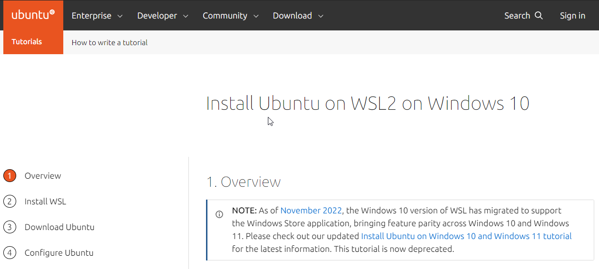

```{r setup, include=FALSE}
knitr::opts_chunk$set(echo = FALSE)
```

## Motivation

-Major Depressive Disorder (MDD) is a common and often debilitating mental health condition that affects millions of people worldwide. While the causes of depression are complex, there is growing evidence to suggest that the gut microbiome may play a role in its development.

-By analyzing differences in gut microbiome we may be able to see what bacteria are harmful or helpful in abundance.

-This could lead to better understanding of the brain gut axis. 

-Could also point towards which supplements would be most benefical to depressed individuals.


## Installation

-Qiime2 is installed using conda on Ubuntu on Windows Subsystem for linux.

-This can be downloaded from the windows store easily. 

- {width="650px"}


## Installation of Qiime2

-wget https://data.qiime2.org/distro/core/qiime2-2023.2-py38-linux-conda.yml

-conda env create -n qiime2-2023.2 --file qiime2-2023.2-py38-linux-conda.yml

-conda activate qiime2-2023.2

-Once activated you will be ready to run qiime2 commands. 


## Data Requirements

-Data Set freely available at link below.

-https://www.ebi.ac.uk/ena/browser/view/PRJNA591924

-Contains 90 young adults (18-25), 43 MDD and 47 Healthy Controls.

-Raw data extracted is also available at https://drive.google.com/drive/folders/1bR7utvwaJqnZ-I7B-iD2kHeuggHrj4c_?usp=share_link


## Running the code 

-Because the code is paired end demultiplexed data we will import it using a manifest file (ManifestWith in gitHub).

-This file is located in github and provides the absolute file path as well 
as the groups for all the forward and reverse reads.

-First Command in qiime2Commmands details this.

-Once imported the commands in the QiimeCommands file should be able to be ran individually to the end.

-This File is located in the main github. 

- {width="650px"}

## Contact Information

-Conner Tomcak

-531-800-4432

-ctomcak@unomaha.edu

